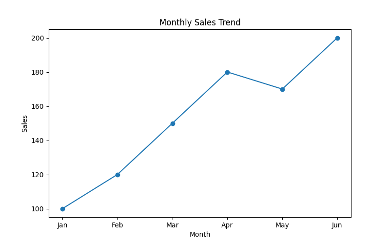
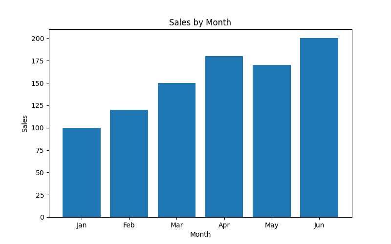
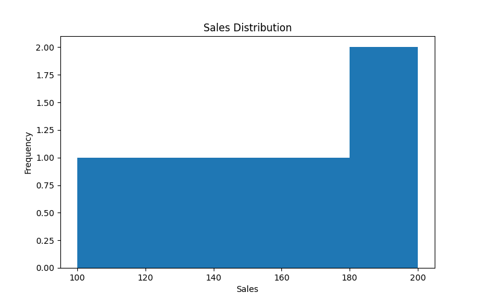
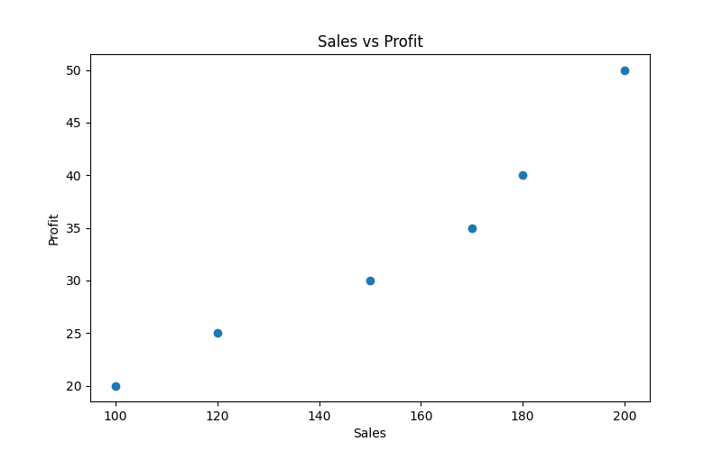

# Data Visualization with Matplotlib

## Project Objective

The objective of this project is to understand and implement fundamental data visualization techniques using Matplotlib. Different chart types are used to represent trends, comparisons, distributions, and relationships within a dataset. Data visualization helps transform raw data into meaningful insights for better decision-making.

---

## Introduction

This project demonstrates Data Visualization using Python and Matplotlib. It covers various chart types such as Line Plot, Bar Plot, Histogram, and Scatter Plot. These visualizations help analyze data, identify patterns, compare values, and understand relationships between variables.

---

# Technologies Used

* Python
* Pandas
* Matplotlib

---

# Topics Covered

* Data Visualization Fundamentals
* Line Plot
* Bar Plot
* Histogram
* Scatter Plot
* Axis Labels and Titles
* Data Analysis and Interpretation

---

# Dataset

The dataset contains monthly sales and profit information used for visualization.

| Month | Sales | Profit |
| ----- | ----- | ------ |
| Jan   | 100   | 20     |
| Feb   | 120   | 25     |
| Mar   | 150   | 30     |
| Apr   | 180   | 40     |
| May   | 170   | 35     |
| Jun   | 200   | 50     |

---

# Project Workflow

1. Import Required Libraries
2. Create and Load Dataset
3. Explore Dataset Information
4. Generate Line Plot
5. Generate Bar Plot
6. Generate Histogram
7. Generate Scatter Plot
8. Analyze Visualizations
9. Draw Insights and Conclusions

---

# Import Libraries

```python
import pandas as pd
import matplotlib.pyplot as plt
```

---

# Create Dataset

```python
data = {
    "Month": ["Jan", "Feb", "Mar", "Apr", "May", "Jun"],
    "Sales": [100, 120, 150, 180, 170, 200],
    "Profit": [20, 25, 30, 40, 35, 50]
}

df = pd.DataFrame(data)

print(df)
```

---

# Dataset Information

```python
print(df.info())
print(df.describe())
```

---

# Line Plot

```python
plt.figure(figsize=(8,5))
plt.plot(df["Month"], df["Sales"], marker="o")
plt.title("Monthly Sales Trend")
plt.xlabel("Month")
plt.ylabel("Sales")
plt.show()
```

---

# Bar Plot

```python
plt.figure(figsize=(8,5))
plt.bar(df["Month"], df["Sales"])
plt.title("Sales by Month")
plt.xlabel("Month")
plt.ylabel("Sales")
plt.show()
```

---

# Histogram

```python
plt.figure(figsize=(8,5))
plt.hist(df["Sales"], bins=5)
plt.title("Sales Distribution")
plt.xlabel("Sales")
plt.ylabel("Frequency")
plt.show()
```

---

# Scatter Plot

```python
plt.figure(figsize=(8,5))
plt.scatter(df["Sales"], df["Profit"])
plt.title("Sales vs Profit")
plt.xlabel("Sales")
plt.ylabel("Profit")
plt.show()
```

---

# Visualizations

## Line Plot



## Bar Plot



## Histogram



## Scatter Plot



---

# Key Insights

* Sales show a steady upward trend from January to June.
* June recorded the highest sales and profit values.
* The Bar Plot helps compare sales across different months.
* The Histogram shows the distribution of sales values.
* The Scatter Plot indicates a positive relationship between sales and profit.
* Higher sales are generally associated with higher profit.

---

# Conclusion

This project demonstrates the fundamentals of Data Visualization using Matplotlib. Different visualization techniques such as Line Plot, Bar Plot, Histogram, and Scatter Plot were used to analyze and interpret data effectively. These visualizations help identify trends, compare values, understand distributions, and discover relationships within the dataset.
